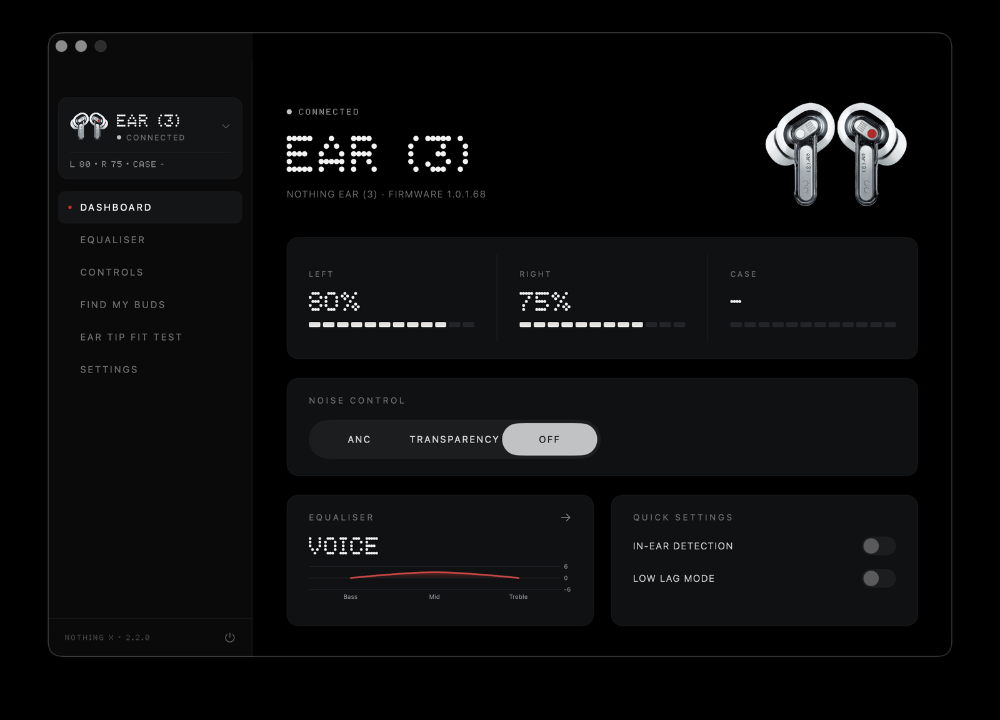
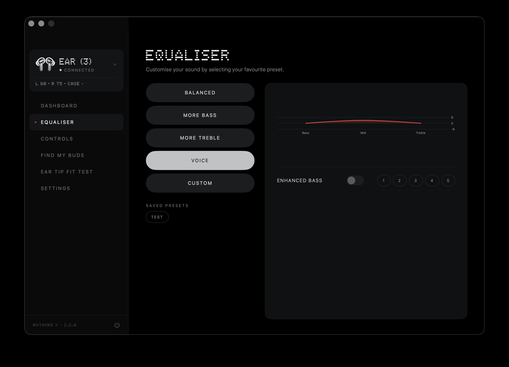
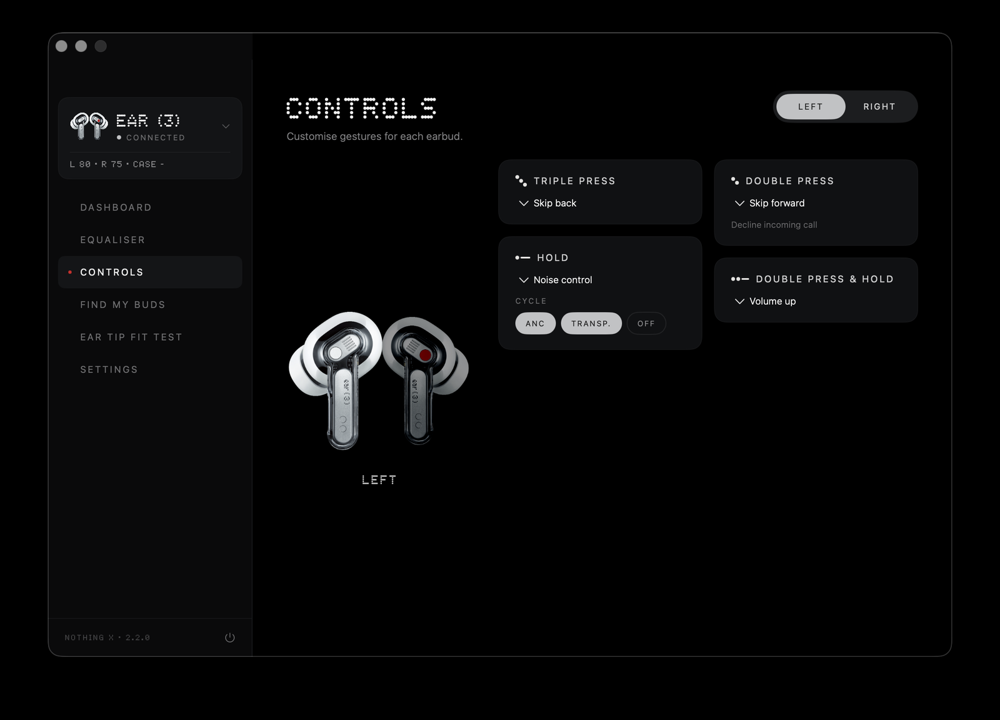
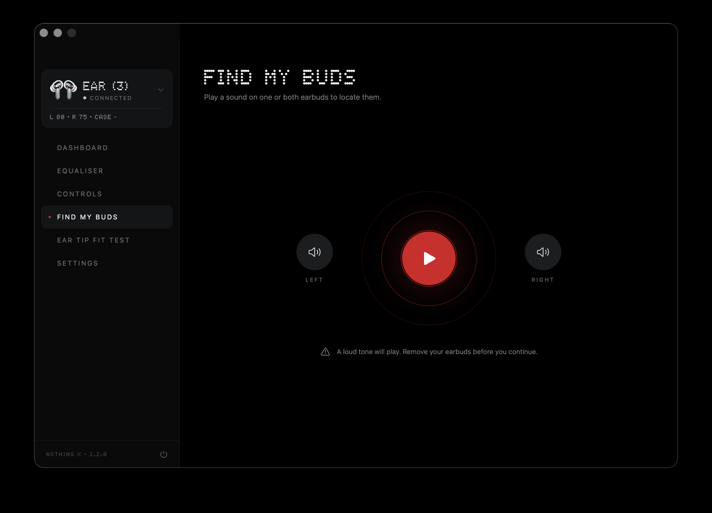
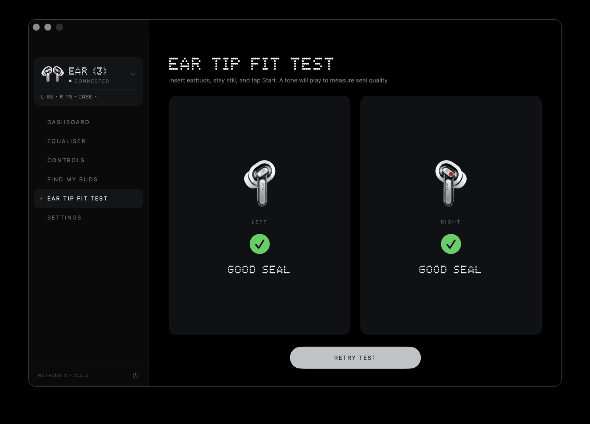
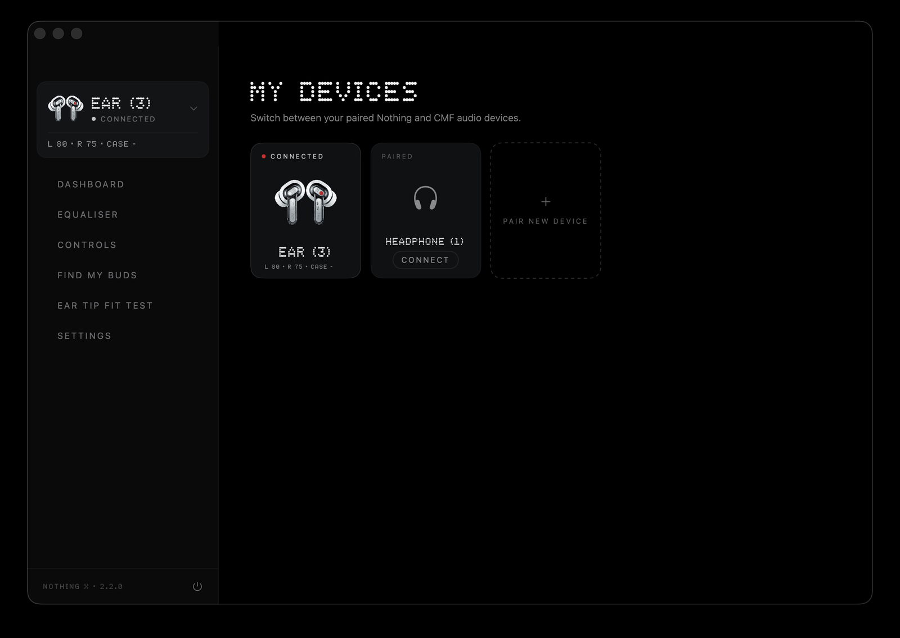
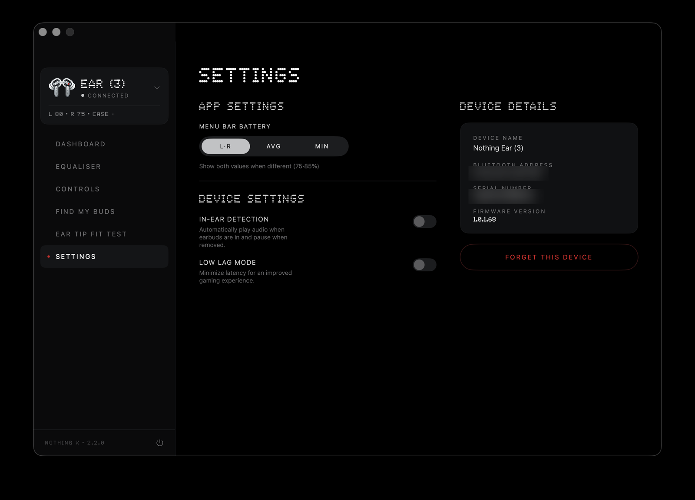
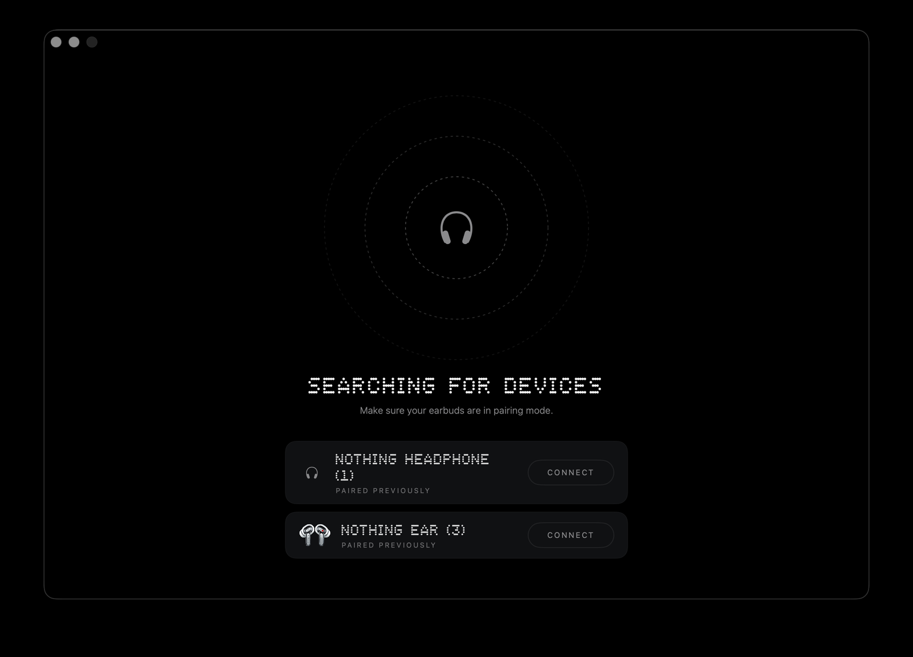
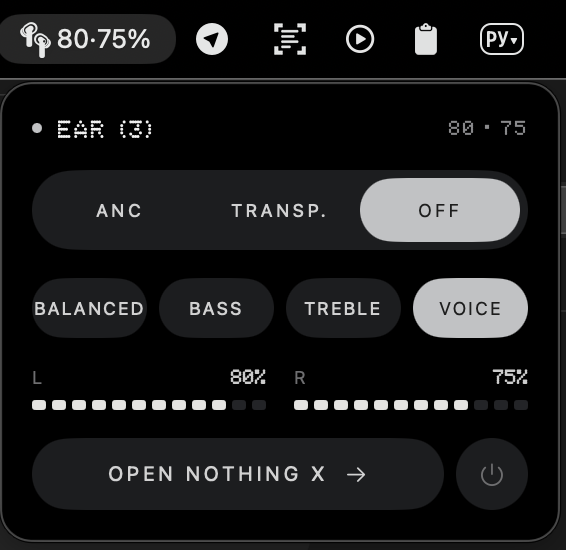

# Nothing X for macOS (Unofficial)

An unofficial macOS companion app for Nothing and CMF earbuds. Inspired by the Nothing X iOS app, built with SwiftUI and Core Bluetooth.

The app lives in your menu bar as a quick panel (noise control, EQ presets, battery at a glance) and opens into a full window with a sidebar for everything else — dashboard, equalizer, gesture controls, device switching, and settings.

## Supported Devices

**Nothing**
- Ear (1), Ear (2), Ear (2024), Ear (3)
- Ear (a), Ear (stick), Ear (open)
- Headphone (1), Headphone (a) *(experimental)*

**CMF by Nothing**
- Buds, Buds Pro, Buds Pro 2
- Buds 2, Buds 2 Plus, Buds 2a
- Neckband Pro, Headphone Pro *(experimental)*

## Features

- **Menu Bar Quick Panel** — Noise control, EQ presets, and battery without opening the app
- **Noise Control** — ANC, Transparency, Off with adjustable levels and customizable cycle modes
- **Equalizer** — Preset profiles (Balanced, More Bass, More Treble, Voice) and Custom EQ with Bass/Mid/Treble sliders
- **EQ Presets** — Save, load, and manage custom equalizer configurations
- **Enhanced Bass** — Adjustable bass boost (device-dependent)
- **Gesture Controls** — Fully customizable press and hold actions per earbud
- **My Devices** — Switch between paired Nothing and CMF devices, pair new ones
- **Find My Buds** — Ring left, right, or both earbuds
- **Ear Tip Fit Test** — Measure ear tip seal quality
- **Battery Display** — Real-time L/R/Case levels in the menu bar with configurable display mode (L·R, AVG, MIN)
- **Low Latency Mode** — Toggle for reduced audio latency
- **In-Ear Detection** — Auto-pause when earbuds are removed
- **Case LED Customization** — RGB color control for case LEDs (Ear (1) only)
- **Device Info** — Name, MAC address, serial number, firmware version

> Feature availability varies by device model.

## Screenshots

<table>
  <tr>
    <td></td>
    <td></td>
  </tr>
  <tr>
    <td></td>
    <td></td>
  </tr>
  <tr>
    <td></td>
    <td></td>
  </tr>
  <tr>
    <td></td>
    <td align="center"></td>
  </tr>
</table>

## Requirements

- macOS 13.0+
- Xcode 14.0+
- Bluetooth-enabled Mac

## Building

1. Clone the repository
2. Open `Nothing X MacOS.xcodeproj` in Xcode
3. Build and run (Cmd+R)

No external dependencies — uses only native Apple frameworks (SwiftUI, Combine, Core Bluetooth).

## Acknowledgements

- [Ear (web)](https://earweb.bttl.xyz) — Bluetooth communication protocol reference
- [Arunavo Ray](https://github.com/arunavo4/nothing-x-macos) — Original UI and project foundation

## Disclaimer

This application is not associated with, sponsored by, or endorsed by Nothing Technology. Text, graphics, logos, imagery, and audio-visual resources within this application are the property of Nothing Technology Limited (80 Cheapside, London EC2V 6EE) and are protected by copyright, trademark, and other intellectual property laws. Use of these resources requires explicit written consent from Nothing Technology. All rights reserved by Nothing Technology.
